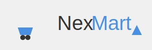

# NexMart 🛒



NexMart is a Flutter-based e-commerce application that offers a seamless shopping experience with a responsive UI and feature-rich functionalities.

## 🌟 Key Features

- **Product Browsing**: Explore a wide range of products fetched from our API
- **Smart Search**: Find products quickly with our intuitive search bar
- **Detailed Product Views**: Get comprehensive information about each item
- **Shopping Cart**: Easily manage your selected items
- **Smooth Checkout**: Hassle-free payment process
- **Secure Payments**: Multiple payment options for your convenience

## 📱 App Screenshots

| Home Screen | Shopping Cart | Payment Screen |
|:-----------:|:---------------:|:-------------:|
|  |  |  |

## Video Reference
<a href="https://youtu.be/DqO6mE1KQJM?si=0gojTe1rU60dFXIt" target="_blank">
  
</a>

## 🛠 Technologies Used

- **Flutter & Dart**: For building a cross-platform, responsive UI
- **Provider**: Efficient state management
- **HTTP & JSON**: Seamless API integration

## 🚀 Getting Started

1. **Clone the Repository**
   ```bash
   git clone https://github.com/akhil-varsh/nexmart.git
   ```
   
2. **Navigate to Folder**
   ```bash
   cd nex
   ```
   
3. **Install Dependencies**
   ```bash
   flutter pub get
   ```

4. **Run the Application**
   ```bash
   flutter run
   ```

## 🔍 About the API

NexMart utilizes the **Fake Store API** to fetch product data:
- **Endpoint**: `https://fakestoreapi.com/products`
- **Data**: Rich product details including id, title, price, description, image URL, and rating

## 🔮 Future Enhancements

- [ ] Advanced search algorithms
- [ ] User authentication and profiles
- [ ] Product filtering and sorting options

## 📄 License

This project is licensed under the MIT License - see the [LICENSE](LICENSE) file for details.

---

<p align="center">
  Made with ❤️ by the Akhil
</p>
